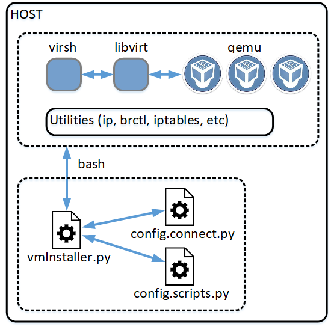
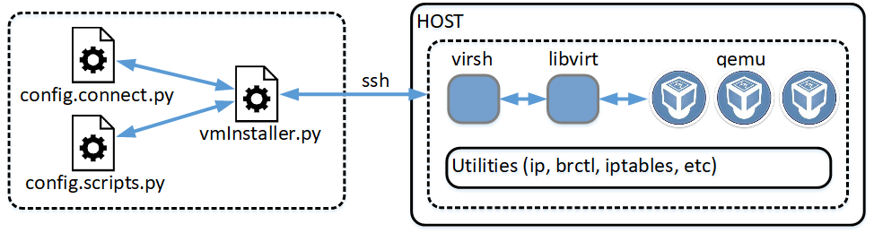
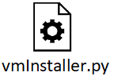
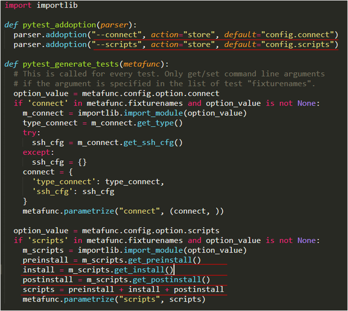
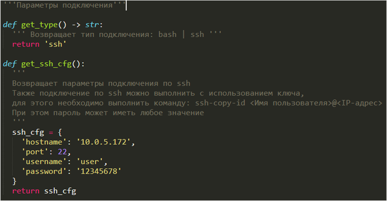
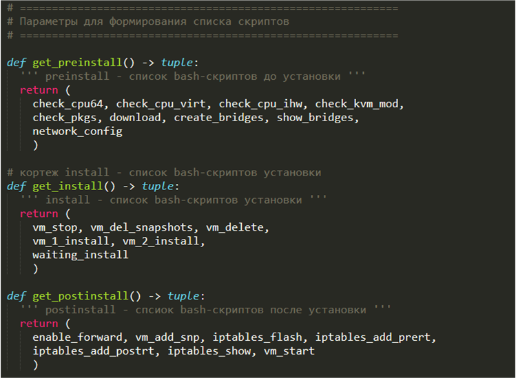
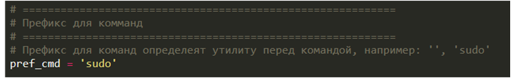
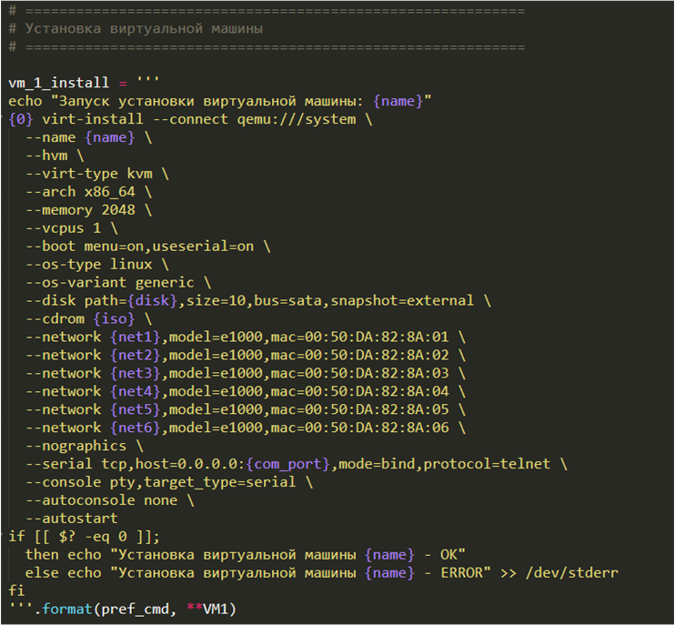
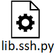

# CD-vmInstall
## Автоматическая развёртывание стенда на виртуальных машинах

### Описание функционирования

Даннный скрип выполняет следующие действия:  
* Подключается (через bash или ssh) к ОС на базе Linux для выполнение команд, параметры подключения задаются в файле ```config.connect```
* Выполнение заданного набора скриптов написанных на bash, набор скриптов задается в файле ```config.scripts```
* Заданные скрипты выполняются последовательно (наборы preinstall, install, postinstall), условием завершения является: оканчание всех скриптов из набора или появление ошибки в ```stderr``` при выполнение скрипта

Подключение через bash:  
  
Подключение через ssh:  
  

### Установка зависимостей
```
apt install python3
apt install python3-pip

pip3 install -r requirements.txt
```

### Запуск

Запуск с настройками по умолчанию (в качестве параметров соединения будут использоватся файл ```config.connect```, в качестве набора скриптов будет использоватся файл ```config.scripts```)
```
pytest --maxfail=1 ./vmInstaller.py
```
Запуск с настройками по умолчанию (в качестве параметров соединения будут использоватся файл ```config.connect```, в качестве набора скриптов будет использоватся файл ```config.scripts```) с выводом ```stdin```, ```stdout```, ```stderr``` для каждого теста:
```
pytest -s --maxfail=1 ./vmInstaller.py
```
Запуск с переопределением файла с набором скриптов:
```
pytest --maxfail=1 ./vmInstaller.py --scripts config.scripts
```
Запуск с переопределением файла параметров соединения и набора скриптов:
```
pytest --maxfail=1 ./vmInstaller.py --connect config.connect --scripts config.scripts
```

### Архитектура проекта

| Объект | Описание |
| - | - |
|  | Скрипт запуска процедуры выполнения скриптов |
| - | !img not found](img/vmInstall_1.png) |
|  | Формирование параметров подключения и наборов скриптов |
| - |  |
|  | Формирование параметров подключения и наборов скриптов |
| - |  |
|  | Формирование параметров подключения и наборов скриптов |
| - |  |
| - |  |
| - |  |
|  | Выполнение команд через bash |
|  | Выполнение команд через ssh |
